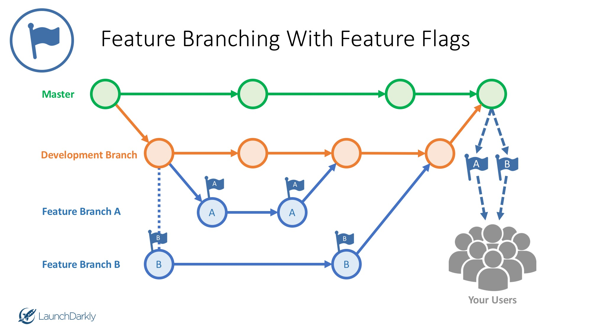

# homestead


## Application Structure

    .
    ├── config                            # config folder       - holds configurations
    │   ├── config.json                   # config.json         - holds json object for dev, test and prod databases (use .env file to store jawsdb config credentials and import as JAWSDB_URL
    │   └── passport                      # passport folder     - holds passport.js login file
    │       └── passport.js               # passport.js         - passport login/sign up functionality
    ├── controller                        # controller folder   - this folder holds all of our api and html routes in the project
    │   ├── api-routes.js                 # api-routes.js       - this file holds all of our api routes
    │   └── html-routes.js                # html-routes.js      - this file holds all of our html routes
    ├── db                                # db folder           - hold our db schema
    │   ├── schema.sql                    # schema.sql          - mysql jawsdb schema - create database
    │   └── seeds.sql                     # seeds.sql           - create seeds for the database. For development purpose only
    ├── gulp-tasks                        # gulp-tasks folder   - holds all gulp related tasks
    │   └── serve.js                      # serve.js            - allows for automatic browser refresh for front end dev work when working on client side js and scss files, concats and builds front end js and css files. 
    ├── models                            # models folder       - holds all of our models
    │   ├── index.js                      # index.js            - generated from sequelize orm
    │   ├── user.js                       # user.js             - model our user - associate a user to a post
    │   └── posting.js                    # posting.js          - model posts our users make, associate a post to a user
    ├── public                            # public folder       - holds assets, build - the css and js files that contain our production files (auto generated from gulp), images - images to our overall project, js - client side javascript used throughout our pages. (Name spacing comes in handy here)
    │   └── assets                        # assets folder       - houses build, images, and client side js
    │       ├── build                     # build folder        - this folder and files are automatically generated by gulp. See gulp tasks for further information (we are not to edit any file in the build folder)
    │       │   ├── css                   # css folder          - generated by gulp, holds concatenated styles.css file used on our pages (this is the file used in our web page)
    │       │   │   ├── styles.css        # styles.css          - the concatenated css file. This is all of our css files, in one giant css file. Generated by gulp. See gulp tasks for how this is concatenated.
    │       │   │   └── styles.css.map    # styles.css.map      - this allows for mapping  scss files to their proper file in the browser to make debugging easier. See gulp tasks for how this is mapped.
    │       │   └── js                    # js folder           - generated by gulp, holds concatenated and minified app.js file used on our pages
    │       │       ├── app.js            # app.js              - all the client side js, concatenated into one file
    │       │       ├── app.min.js        # app.min.js          - all the client side js, minified file, used in our web pages. (this is the file used in our web page)
    │       │       └── app.min.js.map    # app.min.js.map      - this allow for mapping the minified js file to their proper fill-in the browser to make debugging easier. See gulp tasks for how this is mapped.
    │       ├── images                    # images folder       - holds the images to our project
    │       │   ├── image1.jpg            # image1.jpg          - an image.
    │       │   ├── image2.jpg            # image2.jpg          - an image.
    │       │   └── image3.jpg            # image3.jpg          - an image.
    │       ├── js                        # js folder           - holds the client side javascript for our project (this is the client side js we will edit)
    │       │   ├── main.js               # main.js             - here is where the client side js files will live. We will divide them up into separate js files, as many as we need. Namespacing will come in handy here.
    │       │   └── newUserSignUp.js      # newUserSignUp.js    - here is an example of an external client side javascript. This new user sign up js file contains code that gathers information from a form and passes it to the server via Ajax.
    │       └── .eslintrc.js              # .eslintrc.js        - es lint client side js configuration file (we have this as we may want a different configuration than the backend js)
    ├── scss                              # sass folder         - this folder holds our scss partials, and a main styles scss file.
    │   ├── partials                      # partials folder     - this folder holds our scss partials, we break up the scss into sections
    │   │   ├── main.scss                 # main.scss           - this holds main styles
    │   │   ├── header.scss               # header.scss         - this holds header scss
    │   │   ├── buttons.scss              # buttons.scss        - this holds buttons scss
    │   │   └── more.scss                 # more.scss           - we will have more of these types of scss partials
    │   └── styles.scss                   # styles.scss         - here we import all of our partials, this gets consumed by gulp. See gulp tasks for further information.
    ├── views                             # views folder        - this folder holds our handlebars templates
    │   └── layouts                       # layouts             - holds our main.handlebars layout
    │       └── main.handlebars           # main.handlebars     - our main handlebars
    │   └── partials                      # partials folder     - holds all of our handlebars partials
    │       ├── header.handlebars         # header.handlebars   - the handlebars template for our main header
    │       ├── footer.handlebars         # footer.handlebars   - the handlebars template for our main footer
    │       ├── partialone.handlebars     # example.handlebars  - an example partial. We will have many of these
    │       ├── partialtwo.handlebars     # example.handlebars  - an example partial. We will have many of these
    │       └── partialthree.handlebars   # example.handlebars  - an example partial. We will have many of these
    ├── tests                             # tests folder        - hold our unit tests
    │   ├── test1.js                      # test1.js            - unit test 1
    │   ├── test2.js                      # test2.js            - unit test 2
    │   └── test3.js                      # test3.js            - unit test 3
    ├── .editorconfig                     # .editorconfig       - holds text editor configuration file so team members can have the same spacing and indentation
    ├── .env                              # .env                - environment variable file - we hold any private variables here, such as our jawsDB credentials or api keys
    ├── .eslintrc.js                      # .eslintrc.js        - holds eslint rules and configuration
    ├── .gitignore                        # .gitignore          - ignore node modules, .env, .DS_Store, any other file that needs to be ignored
    ├── gulpfile.js                       # gulpfile.js         - gulp file that reads all files from gulp tasks folder, and runs the default task. See gulp tasks to see what is run.
    ├── package-lock.json                 # package-lock.js     - auto generated file
    ├── package.json                      # package.json        - node file holding what the app is all about
    ├── README.md                         # README.md           - information about the project
    └── server.js                         # server.js           - the file that starts the project


- Visit [Homestead](https://obscure-fortress-66993.herokuapp.com/) for demo.

## Purpose
state the purpose for this app
 
## Screenshot
<!-- post any screenshots -->
<!--  -->

## Tech/framework used
<b>Built with</b>
- [Node.js](https://nodejs.org/en/)
- [MySQL](https://www.npmjs.com/package/mysql)
- [Express.js](https://www.npmjs.com/package/express)
- [Handlebars.js](https://www.npmjs.com/package/express-handlebars)
- [Moment.js](https://momentjs.com/)
- [Bootstrap](https://getbootstrap.com/docs/3.3/)
- [JawsDB](https://elements.heroku.com/addons/jawsdb)
- [Sequelize](https://www.npmjs.com/package/sequelize)
- HTML5, CSS3, Javascript and jQuery

# Features
<!-- list any features -->

# Getting Started
- Fork or clone the GitHub repo to your machine.
- Ensure that you have Node.js, MySQL and Gulp installed on your machine.
- If you have a password that protects your MySQL root user, enter that password in the connection.js file in the cloned repo.
- In your CLI, navigate to the cloned directory. `npm install` the dependencies and run `npm start`

  `npm install`

  `npm start`

- Once started, you are able to view the project on `http://localhost:3000/`

- 🎉Happy developing!🎉


# Linting
Before you push your branch up to the `develop` branch, ensure you lint your code.

run `npm run -s eslint .` this will show if you have any ESLint errors or warnings.
If you have any errors, please fix them. if you have warnings that could slide, push your code up or talk with a team member.

# Development 👨‍💻

The command `npm start` will automatically launch the project. navigate to `http://localhost:3000/`

The files watched by gulp are the client js and sass files.

Client side js files are located at `public/assets/js/*.js`. Editing these files and saving will kick off a gulp build and auto refresh your development workspace.

Sass files are located at `sass/partials/*.scss`. Editing these files and saving will kick off a gulp build and auto refresh your development workspace.

If you're editing any file outside of `public/assets/js` or `sass/partials`, we recommend running `npm run watch`, this runs nodemon, which watches all of our files.


### Branching process

- Master is a 🔒protected branch🔒. This means we need at least 1 approval before we merge into our master branch. (having the master branch protected helps so we know for sure what is going into master, and noone can accidentally push code to it and break our site)
- Develop will be the branch we create branches off of. Develop will be merged into master at the end of every day.
- This screenshot 👇 illustrates this process
- Feature A and Feature B are branches where we code our tasks. Once finished with making your edits, we merge that branch into develop. At the end of everyday, develop gets merged into master.
- Then develop is updated with the latest version of master, and the process happens all over again.



Here is a helpful reminder of the git process when creating, adding to, committing and pushing branches. Refer to this whenever needed, as working in a team environment with branches really helps keep everyones code organized and makes the project much more manageable.

```
1. Start on a clean branch

  1.1 Check which branch you're on `git branch`

  1.2 Start on develop branch, `git checkout develop`

  1.3 Do a `git pull` to get the latest copy of develop

  1.4 Create your new branch to code your story, `git checkout -b <branchname>` (Title your branch name the title of the story you're working on, replace spaces with -)

  1.5 Now you're on your own branch. Type `git branch` to see you're on your new branch

  1.6 Now write your code ✏️
```

```
2. You're done writing code, time to add your files and commit message to your branch

  2.1 Once you're code is done for the story you're working on, run `npm run -s eslint .` to see if any linting errors/warnings. fix anything that is outstanding. next we will add your changes to your branch and commit them.

  2.2 Type `git status` to see the status of the files you've worked on. (these should be red, because you havent added them yet)

  2.3 To add these files, type `git add .` to add all files

  2.4 Type `git status` again, you will now see the files are green, which indicates they have been added to your branch

  2.5 Now make your commit message that says specifically what code you changed in this story. `git commit -m "your commit message here"`
```  

```
3. You're ready to push your branch up to github

  3.1 Next, push your code up to the repository, with a `git push origin <branchname>`

  3.2 Once your branch is pushed up, navigate to our repo, and you can see branch under "Your recently pushed branches:". Click on Compare & pull request

  3.3 ❗Choose the base branch `development` as that will be the branch that you merge your branch into. (the development branch will be merged into master daily TODO: determine when we want builds to master branch to happen ❓)

  3.4 On the right hand side, add reviewers to review your pull request. Then click "Create Pull Request"

  3.5 Once your pull request is approved and merged, it will be 🙌built out into master🙌 during the next build to production. (TODO: determine when we want builds to maste branch to happen ❓)
```


### Find a bug or want to add an issue? 🕵️

- Document what the issue is, if you can find the root problem, write whatever you have down
- Go to the Issues tab, create a new issue
- Assign it to yourself if you want to work on that issue, or leave it blank and someone else can assign themselves to it if they want to take on the challenge
- Add a label to it. Most are going to be bugs or enhancement
- [See bucky talk about this in more detail](https://www.youtube.com/watch?v=YshvUGgF_3o)

